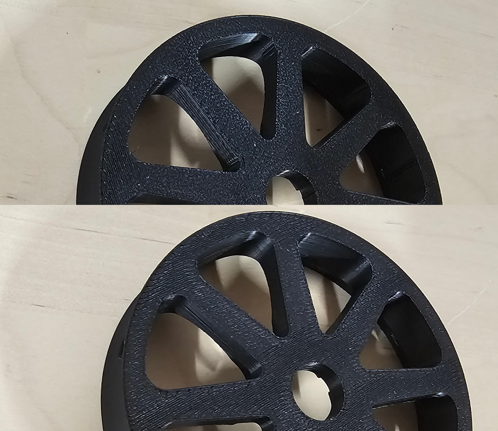
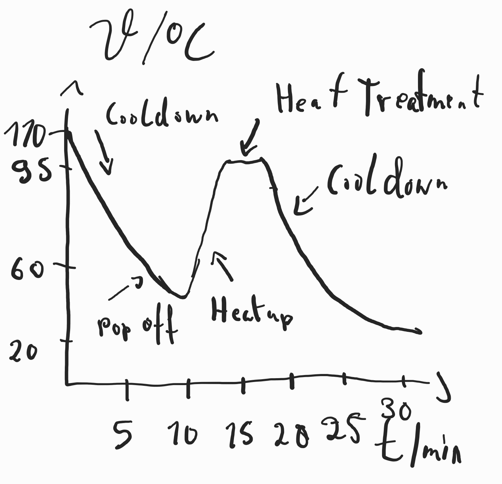

# RELAX: Release and Destress Cycle for 3D Printing

RELAX is a Klipper macro for automating the process of releasing 3D printed parts from the bed and performing destress heating to minimize stress marks and thermal-induced warping. The macro is configurable, allowing you to adjust temperatures, times and BEDFANS (if available)

---

## Motivation
The RELAX macro was created to address a common problem in 3D printing: stress marks caused by thermal contraction, often referred to as "white marks." While heat guns are a standard solution, they are not always practical or efficient for every scenario:

- **Thin Parts**: Thin parts tend to soften and bend under a heat gun before the stress marks disappear, making manual treatment unsuitable.
- **Efficiency**: Automating the process is critical when dealing with large-scale production or repeated tasks. Treating a few hundred parts a day with a heat gun is not only time-consuming but also tedious.
- **Consistency**: Manual processes can vary in effectiveness. RELAX ensures that each part undergoes a consistent and repeatable treatment cycle.

By integrating RELAX into the post-printing workflow, users can enjoy the benefits of automated stress relief, saving time and effort while improving part quality. This macro was designed with both hobbyists and professionals in mind, enabling smooth, repeatable destressing without manual intervention.

---

## Features

- **Release Parts Automatically**: Heat the bed to a configurable release temperature, allowing parts to detach smoothly.
- **Destress Heating**: Relieve internal stresses in your printed parts with controlled heating and holding cycles.
- **Optional Bed Fan Support**: Use bed fans during the process for quicker cooling.
- **Customizable Parameters**: Fine-tune temperatures and durations to match your material and project requirements.
- **Auto Updates via Git**: Easily update the macro through Moonraker's update manager with Git.

---

## Before and After

### Before and After Destressing


---

## How It Works:

- **Release Cycle**: Heats the bed to a specific temperature to allow parts to release naturally.
- **Destress Cycle**: Holds the bed at a destress temperature for a set duration to reduce stress marks and prevent warping.
- **Cooldown: Safely**: shuts down the printer or cools to a final temperature.



---

## Installation

1. Clone the RELAX repository into your Klipper configuration directory:
   ```bash
   cd
   git clone https://github.com/interias/RELAX.git
   ln -s ~/RELAX printer_data/config/RELAX
   ```

2. Include the RELAX macro file in your main Klipper configuration:
   ```ini
   [include RELAX/relax.cfg]
   ```

3. **Integrate into `PRINT_END`:** Add the following line to your `PRINT_END` macro to automatically invoke the RELAX cycle at the end of a print:
   ```ini
   RELAX
   ```

4. **Enable Automatic Updates via Moonraker**:
   Add the following entry to your `moonraker.conf` file to manage updates through Moonraker:
   ```ini
   [update_manager relax]
   type: git_repo
   origin: https://github.com/interias/RELAX.git
   path: ~/RELAX
   managed_services: klipper
   ```

---

## Usage

To execute the RELAX macro manually, you can call it with default settings:
```gcode
RELAX
```

Or customize parameters for your specific use case:
```gcode
RELAX release_temp=60 release_time=150 destress_temp=110 destress_time=400 use_bedfans=true
```

### Parameters
- `release_temp`: Target temperature to release parts from the bed (default: 50°C).
- `release_time`: Time in seconds to hold the release temperature (default: 120s).
- `destress_temp`: Target temperature for stress relief (default: 100°C).
- `destress_time`: Time in seconds to hold the destress temperature (default: 300s).
- `use_bedfans`: Enable or disable bed fans (`true` or `false`, default: `false`).

---

## Example

An example use case for ABS:
```gcode
RELAX release_temp=60 release_time=150 destress_temp=110 destress_time=400 use_bedfans=true
```

---


### Feedback and Contributions

We value your input to improve RELAX! Please share your feedback and experiences with us, including:

- **Temperatures**: What release and destress temperatures worked best for your material?
- **Timing**: Optimal hold times for release and destress cycles.
- **Results on Warping**: How effective was the destress cycle in reducing warping or stress marks?
- **Pictures**: Share before-and-after photos of your parts to help refine the process.

You can provide feedback through:
- **Author**: Stefan Börzel
- **Discord**: `sbrzl_3.14`
- **GitHub Issues**: [RELAX GitHub Repository](https://github.com/interias/RELAX/issues)

Your contributions will help us create a better experience for everyone! 😊

---

## License

This project is open-source under the MIT License. Feel free to use, modify, and share the code with attribution.
